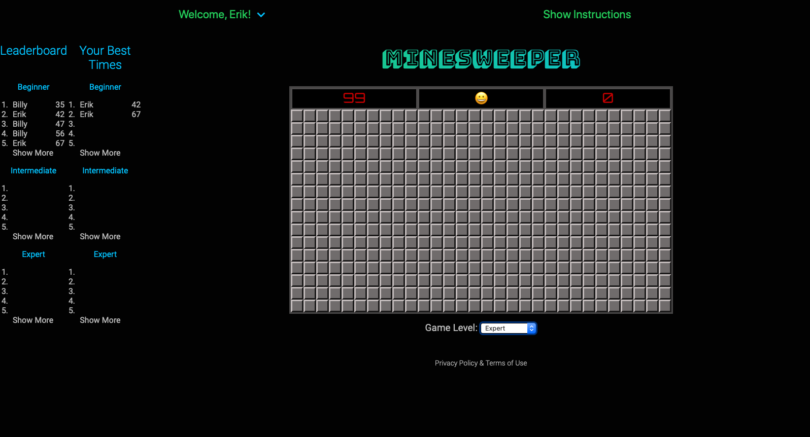

# Minesweeper
This is my own version of the classic Minesweeper computer game.  

It's a full stack app built with Node.js, Express, Mongoose, and MongoDB to store users' scores, and JavaScript for the game logic.

You can try it out here: https://minesweeper-fun.glitch.me/.

